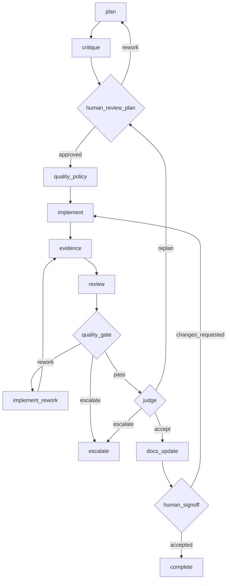
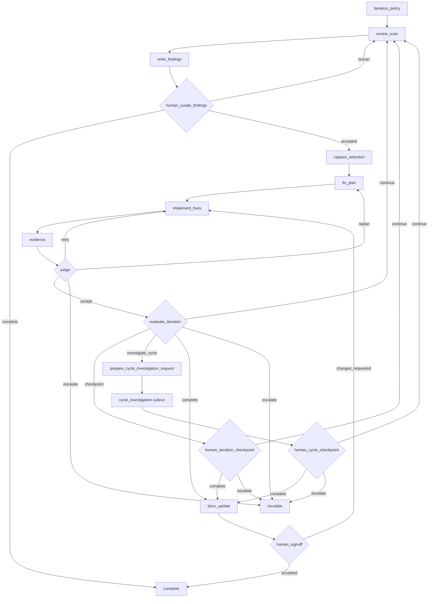
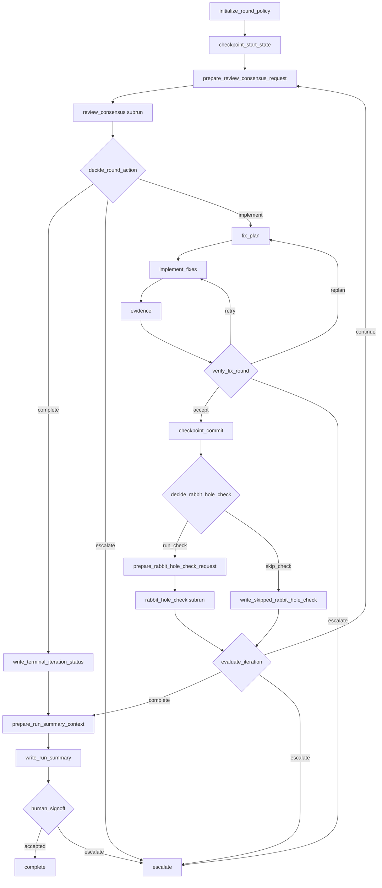
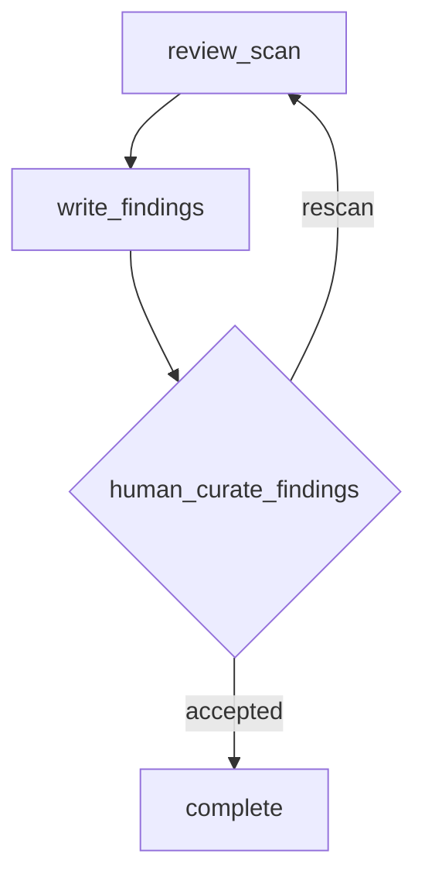
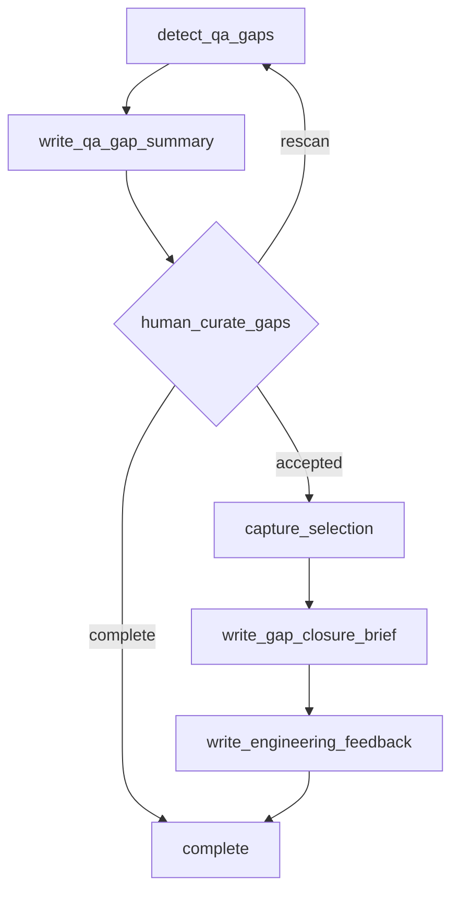
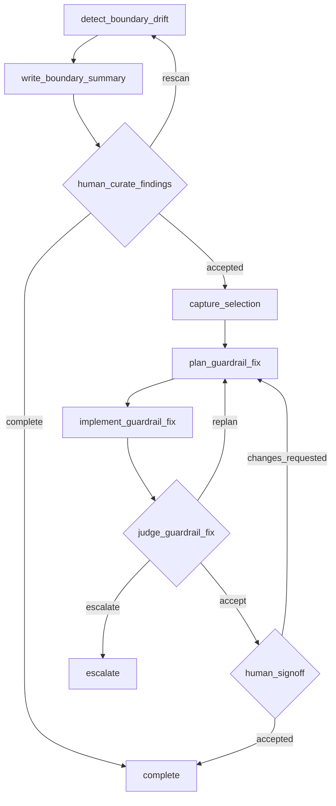

# Templates

This directory contains the shipped Forge workflow templates.

Each template bundle has its own `workflow.json`, prompts, helper scripts, and
template-local README. This index summarizes the process in each flow and shows
the control path at a glance.

## Shipped Templates

- [`implement-change`](implement-change/): plan, implement, review, gate, judge, and sign off a requested change
- [`review-and-fix`](review-and-fix/): review first, curate findings, remediate a bounded slice, then decide whether another round is worthwhile
- [`auto-review-and-fix`](auto-review-and-fix/): fully automated review consensus plus bounded remediation with checkpoint commits and only a final human signoff
- [`review-only`](review-only/): discovery-only review that stops after curated findings
- [`qa-gap-guard`](qa-gap-guard/): audit QA gaps and produce remediation guidance without changing code
- [`architecture-guard`](architecture-guard/): detect architecture drift against governance artifacts and remediate selected violations

## Implement Change

Use this when the run should deliver a requested change end to end, with a
bounded machine review loop and explicit human checkpoints.

Process summary:

- drafts a plan, critiques it, and waits for human approval
- freezes a quality policy before coding starts
- implements, gathers evidence, and runs adversarial review
- loops through rework while the quality gate permits it
- finishes with a final judge pass, docs update, and human signoff

## Review And Fix

Use this when the run should start as a review, then remediate only the
accepted findings, with bounded iteration between review and repair.

Process summary:

- freezes an iteration policy, then scans the repo for actionable findings
- requires a human to choose which findings are real and worth fixing
- plans and implements only the curated slice, then judges the result
- uses a second iteration decision to determine whether another round is worth doing
- can launch a child investigation workflow if it detects a likely repeated cycle

## Auto Review And Fix

Use this when a large branch should go through several unattended review/fix
cycles, with reviewer disagreement handled inside automation rather than by a
human checkpoint on every round.

Process summary:

- freezes an automation policy, freezes any repo-local governance notes once, and optionally creates a baseline checkpoint commit before unattended review rounds begin
- runs a child review-consensus loop where one agent reviews the code and a second agent audits that review before any fix is attempted
- records terminal iteration status when review consensus decides the branch is already stable enough to stop without another fix round
- commits each accepted remediation round so the branch history shows how the code stabilized over time
- can launch a rabbit-hole investigation subrun when an accepted round suggests wider drift before deciding whether to continue
- writes a final run summary for a single human signoff at the end instead of human curation on every round

## Review Only

Use this when the run should stop at review output and should not implement
fixes.

Process summary:

- scans the repository for findings
- rewrites those findings into a human-readable summary
- lets a human either accept the review output or request one more scan

## QA Gap Guard

Use this when the run should audit QA and testing posture, then produce a clean
follow-up package for later engineering work.

Process summary:

- detects meaningful QA gaps against the current request and governance artifact
- summarizes the gaps for human curation
- packages the selected gaps into structured state
- emits a remediation brief and engineering feedback instead of applying code changes

## Architecture Guard

Use this when the source of truth is an architecture governance contract and the
run should detect and remediate selected contract drift.

Process summary:

- detects drift against the architecture contract and related governance inputs
- summarizes the findings and waits for human curation
- plans and implements fixes only for the selected violations
- requires both machine judgement and final human signoff before completion
